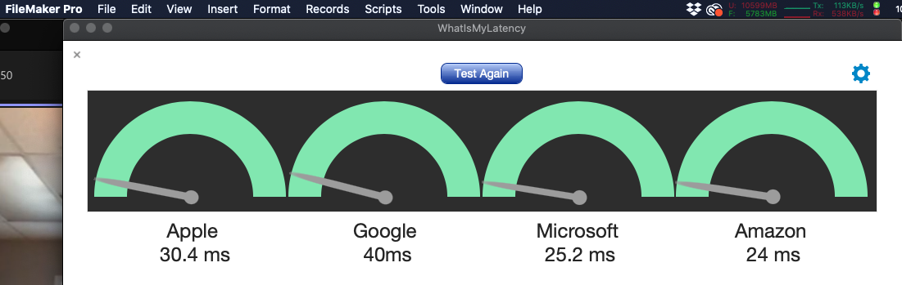

# WhatIsMyLatency

#### A FileMaker Pro Add-On

Quickly determine the network latency between the user (via FileMaker Pro) and user defined server URL(s) (up to 4 URLs can be user defined).

#### Points To Ponder

If the user defines one of the servers to be their own FileMaker Server URL, and defines the other three servers to be popular URLs (Google, Apple, Amazon, etc), then the results of this latency test can help reveal helpful network information.

If all the servers return high latency values then maybe the users complaints of a sluggish internet connection can be attributed to their overall internet connection via their ISP.

On the other hand, if their FileMaker Server URL latency test value is much higher than the other popular servers, then maybe the user's FileMaker Server is the cause of the reported sluggishness.

#### Installation

1. Download "WhatIsMyLatency.fmaddon"

2. Double-click the downloaded file to open FileMaker Pro and it will be automatically installed into the correct directory

3. Open or create the database you wish to add "WhatIsMyLatency" to

4. Create a new, empty "Form" layout

5. In Layout mode, make sure that you have the left side "Objects" pane visible, and click on the "Add-ons" tab

6. Click on the Add "+" button (lower right of pane)

7. Scroll thru the list of possible Add-Ons and select "WhatIsMyLatency" and click "Choose" button

8. Drag newly added Add-On icon over into the layout body

9. Add-On has now been installed, adding the following:
  1. "Whats My Latency" button to this Layout
  2. "WhatsMyLatency" folder in the Scripts list, with 3 new Scripts
  3. "WhatIsMyLatency" Table with 16 Fields and 1 Record
  4. 2 new Layouts: "WhatIsMyLatency" & "Settings"

#### Usage

1. Click on the provided button "Whats My Latency" to run the test with the 4 default server URLs

2. When finished, click on the "Test Again" button to run the test again

3. When finished, click on the Gear icon (Settings) to configure the Add-On
